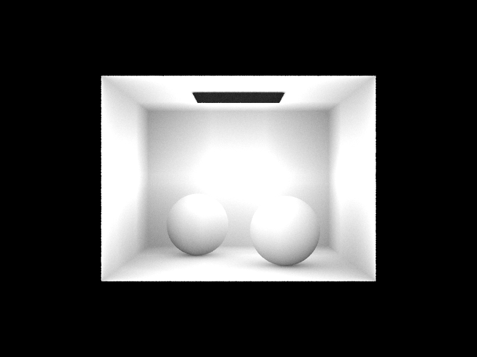

# Pathtracing Ambient Occlusion

##### To build:
    mkdir build
    cd build
    cmake ..
    make

##### Usage:
    Usage: ./pathtracer [options] <scenefile>
    Program Options:
      -s  <INT>        Number of camera rays per pixel
      -l  <INT>        Number of samples per area light
      -x  <DOUBLE>     Ambient occlusion radius; must be > 0.0  
      -t  <INT>        Number of render threads
      -f  <FILENAME>   Image (.png) file to save output to in windowless mode
      -r  <INT> <INT>  Width and height of output image (if windowless)
      -h               Print this help message

Example: `./pathtracer -m 0.7 -s 8 -l 128 -t 20 ../dae/sky/CBspheres_lambertian.dae`
    

